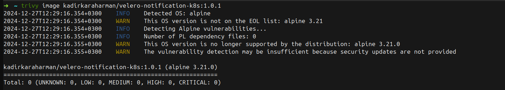

# Velero Notification App

## Overview

The **Velero Notification App** is a lightweight application designed to integrate with Velero backups in Kubernetes. It sends notifications about Velero backup statuses to various platforms such as Microsoft Teams, Telegram, and Email. The app ensures that users stay informed about their backup operations in real-time without needing to manually monitor the Velero system.

## Features

- Sends notifications for Velero backup statuses (e.g., `Completed`, `Failed`, `PartiallyFailed`).
- Supports multiple notification providers:
  - Microsoft Teams
  - Telegram
  - Email
- Ensures deduplication of notifications to avoid duplicate messages for the same backup.
- Highlights failed and partially failed backups for immediate attention.
- Includes a health check API (`/healthz`) to monitor the application's status.
- Dockerized for ease of deployment.
- Zero vulnerabilities detected with Trivy scan.

## Prerequisites

To use this application, ensure the following:

1. A working Kubernetes cluster.
2. Velero installed and configured in your cluster.
3. Kubernetes CLI (`kubectl`) installed and configured.
4. Docker and Minikube installed (optional, for local testing).

## Getting Started

### Pull the Docker Image
The public Docker image can be pulled using the following command:
```bash
docker pull kadirkaraharman/velero-notification-k8s:1.0.1
```

### Pull the Repository
1. Clone the GitHub repository containing the YAML manifests:
   ```bash
   git clone https://github.com/kadirkaraharman/Velero-Notification-K8s.git
   cd Velero-Notification-K8s
   ```

### Configuration
The application uses a ConfigMap to store configuration details. Update the `configmap.yaml` file to set your:

- Notification provider credentials (e.g., Microsoft Teams webhook URL, Telegram bot token, Email SMTP settings).
- Custom environment variables for fine-tuning the behavior of the application.

Example ConfigMap:
```yaml
apiVersion: v1
kind: ConfigMap
metadata:
  name: velero-watcher-config
  namespace: velero
data:
  USE_TELEGRAM: "true"
  TELEGRAM_CHAT_ID: "<TELEGRAM_CHAT_ID>"
  TELEGRAM_BOT_TOKEN: "<TELEGRAM_BOT_TOKEN>"
  USE_TEAMS: "true"
  TEAMS_WEBHOOK_URL: "<TEAMS_WEBHOOK_URL>"
  USE_EMAIL: "true"
  SMTP_SERVER: "<SMTP_SERVER>"
  SMTP_PORT: "<SMTP_PORT>"
  EMAIL_SENDER: "<EMAIL_SENDER>"
  EMAIL_PASSWORD: "<EMAIL_PASSWORD>"
  EMAIL_RECIPIENTS: "<EMAIL_RECIPIENTS>"
  ENVIRONMENT_NAME: "<ENVIRONMENT_NAME>"
```

### Deploy the Application
1. Apply the YAML manifests to your Kubernetes cluster:
   ```bash
   kubectl apply -f .
   ```
2. Verify the deployment:
   ```bash
   kubectl get pods -n velero
   kubectl logs <pod-name> -n velero
   ```


### Health Check API
The application provides a health check API at `/healthz` running on port `8081`. You can use this endpoint to verify the application's status.

Example response:
```json
{
  "status": "healthy",
  "memoryUsage": "3.12 MB",
  "numGoroutine": 5
}
```

### Usage
Once deployed, the Velero Notification App will automatically detect backup status changes and send notifications to the configured platforms. For example:

- A `Completed` notification indicates a successful backup.
- A `Failed` notification will be flagged for immediate attention.
- A `PartiallyFailed` notification will also be flagged for attention.

### Environment Variables
The application supports the following environment variables:

| Variable            | Description                          |
|---------------------|--------------------------------------|
| `USE_TELEGRAM`      | Enable Telegram notifications.       |
| `TELEGRAM_CHAT_ID`  | Chat ID for Telegram notifications.  |
| `TELEGRAM_BOT_TOKEN`| Bot token for Telegram notifications.|
| `USE_TEAMS`         | Enable Microsoft Teams notifications.|
| `TEAMS_WEBHOOK_URL` | Webhook URL for Microsoft Teams.     |
| `USE_EMAIL`         | Enable Email notifications.          |
| `SMTP_SERVER`       | SMTP server hostname.                |
| `SMTP_PORT`         | SMTP server port.                    |
| `EMAIL_SENDER`      | Email account username.              |
| `EMAIL_PASSWORD`    | Email account password.              |
| `EMAIL_RECIPIENTS`  | Comma-separated email recipients.    |
| `ENVIRONMENT_NAME`  | Name of the environment (e.g., prod).|

### Security
Sensitive information such as webhook URLs, API tokens, and SMTP credentials can be stored securely using environment variables or Kubernetes Secrets.

### Troubleshooting
- Check application logs for debugging:
  ```bash
  kubectl logs <pod-name> -n velero
  ```
- Ensure that Velero is correctly configured and running in the cluster.
- Verify that the notification provider credentials are valid.

## Dockerfile
The application is built using a minimal Dockerfile based on Alpine Linux. It ensures a small image size and secure dependencies. The image passes a Trivy scan with zero vulnerabilities.

## Trivy Scan

We conducted a Trivy scan to ensure the Docker image is free of vulnerabilities. Below is the output of the scan:




## License
This project is licensed under the MIT License. See the LICENSE file for details.
